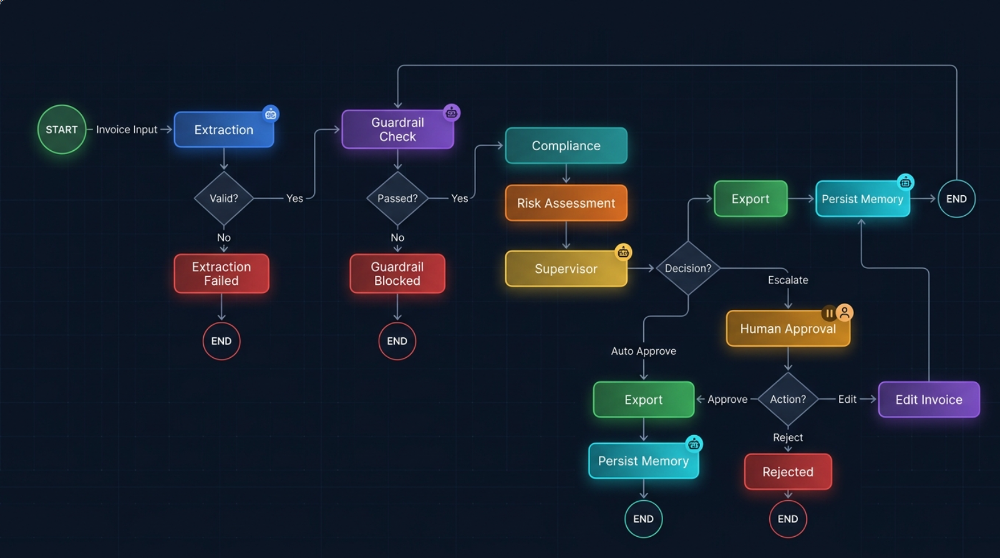

# LedgerLens AI — Multi-Agent Invoice Processing System

An automated finance-ops pipeline that takes a raw invoice (PDF, scanned, or photographed) and takes it all the way from **extraction → contract compliance → fraud/risk scoring → an approve/reject decision**, escalating to a human only when something actually needs one.

This isn't a single LLM call wrapped in a UI. It's five independent agents coordinated by a Supervisor, with real memory, real guardrails, and a measured accuracy number — not a guess.

---

## What it does

A company uploads an invoice. The system:

1. **Extracts** structured data from it — regardless of whether it's a clean digital PDF, a decent scan, or a badly blurred photo.
2. **Validates** it against that vendor's actual contract terms (payment terms, price ranges, invoice caps, freeform clauses like late-fee or bulk-discount policies).
3. **Scores fraud/anomaly risk** using that vendor's real billing history — duplicate detection, first-time-vendor flags, and price-deviation alerts that get smarter the more invoices a vendor has on file.
4. **Decides**: auto-approve if everything's clean and small enough, or escalate to a human — who can approve, reject, or edit the invoice (with automatic re-validation after every edit).
5. **Remembers**: every approved invoice becomes part of that vendor's history for next time.
6. **Reports**: a separate agent summarizes activity on its own schedule, independent of the live pipeline.

Nothing gets exported above a hard amount ceiling — not even if a human clicks "approve." That's enforced in code, not left to anyone's judgment.

---

## Workflow



The pipeline is a real LangGraph state machine, not a fixed script:

- **Extraction** fails closed — a bad/unreadable PDF routes straight to `Extraction Failed`, never reaching anything downstream.
- **Guardrail Check** runs immediately after extraction, before Compliance or Risk ever see the data. Pure arithmetic checks (do the line items actually sum to the total? does quantity × rate match each line's amount?) — if the numbers don't add up, nothing downstream is trusted to reason about them.
- **Compliance** and **Risk** run independently, each with their own tools, then hand their findings to the **Supervisor** — which doesn't do any checking itself, only decides based on what the specialists found.
- **Human Approval** is a real pause, not a poll — the graph checkpoints its state and waits, potentially indefinitely, for a person to approve, reject, or edit.
- **Edit** loops back through **Guardrail Check** and **Compliance** again — an edited invoice is re-validated from scratch, not rubber-stamped.
- **Export** is the single chokepoint every approval path funnels through, which is also where the hard dollar ceiling is enforced — unbypassable regardless of what got decided upstream.
- **Persist Memory** only fires on genuine approval — a rejected invoice is never learned as "normal" billing behavior.

---

## The five agents

| Agent | Job | Independent tools it owns |
|---|---|---|
| **Extraction** | Reads the raw invoice, decides text vs. OCR vs. vision automatically | `pdfplumber`, Tesseract OCR, Groq (text), Gemini (vision), with automatic provider fallback |
| **Compliance** | Checks extracted data against that vendor's actual contract | Vectorless lookups (exact fields — pricing, payment terms) + traditional RAG (freeform contract clauses) |
| **Risk** | Scores fraud/anomaly risk using vendor history | Duplicate detector (exact + fuzzy), historical pattern analysis with real memory |
| **Supervisor** | Takes Compliance + Risk output, decides auto-approve vs. escalate | Routing logic, the hard-ceiling guardrail |
| **Reporting** | Summarizes activity on its own schedule | Runs independently — cron/Task Scheduler, not triggered by the live pipeline |

---

## Major functionality

**Three-tier extraction with automatic provider fallback**
Text PDFs go straight to (Gemini's text-only provider). Scanned invoices run through local Tesseract OCR first — if OCR is confident, that text goes to Gemini-ocr; if not, it falls to Gemini vision. If Gemini fails for *any* reason (bad key, network outage, rate limit), the LLM Gateway automatically retries with Groq-text instead of crashing. Every routing decision and fallback is logged for a real "X% routed to the low-cost path" metric.

**Vectorless + traditional RAG, used deliberately**
Exact-field checks (payment terms, price ranges) use plain dictionary lookups — no embeddings, because embeddings would be slower, costlier, and no more accurate for an exact match. Freeform contract clauses (late fees, bulk discounts, damaged-goods policy) use real embedding-based retrieval, because that's a genuine semantic search problem. The RAG query itself is context-aware — an unmatched line item and a large order pull back different, actually-relevant clauses instead of one generic search every time.

**Guardrails that don't depend on any agent's judgment**
Line-item math must reconcile with the stated total. Each line's amount must equal quantity × rate. Values must be positive. Line-item counts must be sane. All of this runs as pure code, before Compliance or Risk ever see the data — an LLM never gets a chance to reason its way around a number that doesn't add up.

**A genuinely unbypassable hard ceiling**
No invoice above the configured threshold is ever exported — not on auto-approve, not even if a human explicitly clicks "approve." Enforced at the single code chokepoint every approval path passes through, not just mentioned as an early warning.

**Real memory, not a static ruleset**
The Risk Agent's sense of "normal" for a vendor is built from that vendor's actual approved-invoice history in Supabase, and gets more precise the more invoices are processed. A vendor with a perfectly consistent billing history triggers a severe flag on the first invoice that breaks the pattern, even before there's enough data for a standard deviation to be meaningful.

**Human-in-the-loop, with real re-validation**
Escalated invoices pause the graph and wait for a person — approve, reject (with a reason), or edit specific fields (including individual line items, with the invoice total auto-recalculated from the corrected subtotal and tax). An edit isn't accepted on faith; it goes through Compliance and the guardrails again.

**A measured accuracy number, not a guess**
31 labeled invoices across 5 vendors, covering clean invoices, exact/fuzzy duplicates, every compliance violation type, every guardrail violation type, and a controlled price-deviation sequence. Guardrails, Compliance, and Risk are all independently verified at 100% against this labeled set — including one real bug and one real ground-truth error that the eval process itself caught and that got fixed, not hidden.

**Web frontend + FastAPI backend**
A full browser-based UI (`web/`) sits on top of a FastAPI backend (`api.py`) that wraps the exact same LangGraph pipeline the CLI uses — no reimplementation. Supabase Auth gates every request; invoice PDFs go into a private Supabase Storage bucket; per-user quotas (25 invoices / 20 contracts per rolling 30 days) are enforced server-side.

---

## Tech stack

- **Orchestration:** LangGraph (StateGraph, conditional edges, interrupt/resume, checkpointing)
- **Models:** Google Gemini (text extraction/vision), Groq (text extraction/fallback)
- **OCR:** Tesseract (local, no API cost)
- **RAG:** `sentence-transformers` (local embeddings) for contract clauses
- **Database:** Supabase (Postgres) for vendor history, memory, auth, and file storage
- **API:** FastAPI + Uvicorn
- **Frontend:** Vanilla HTML/CSS/JS (`web/`)
- **Validation:** Pydantic throughout — every agent's output is a strict schema, never free text
- **PDF handling:** `pdfplumber`, `pdf2image`, `pypdf`
- **Tracing:** LangSmith (optional, via `LANGCHAIN_TRACING_V2`)

---

## Project structure

```
├── agents/                   # Extraction, Compliance, Risk, Reporting agents
│   ├── extraction_agent.py
│   ├── compliance_agent.py
│   ├── risk_agent.py
│   └── reporting_agent.py
├── core/                     # Pydantic schemas (Invoice, ComplianceResult, RiskResult, etc.)
│   ├── schema.py
│   ├── compliance_schema.py
│   ├── risk_schema.py
│   ├── guardrail_schema.py
│   └── report_schema.py
├── graph/                    # LangGraph state, nodes, and the compiled Supervisor graph
│   ├── state.py
│   ├── nodes.py
│   └── supervisor_graph.py
├── tools/                    # Vectorless lookups, contract RAG, duplicate detection,
│   │                         # historical patterns, guardrails, LLM gateway, decision logger
│   ├── contract_rag.py
│   ├── decision_logger.py
│   ├── duplicate_detector.py
│   ├── guardrails.py
│   ├── historical_pattern.py
│   ├── llm_gateway.py
│   ├── ocr_tool.py
│   ├── report_data.py
│   ├── routing_logger.py
│   ├── vectorless_lookup.py
│   └── mock_supabase.py
├── web/                      # Browser frontend (HTML/CSS/JS)
│   ├── index.html
│   ├── style.css
│   └── app.js
├── data/                     # vendor_contracts.json, human_decisions.jsonl, routing_log.jsonl
├── evals/                    # ground_truth.json + eval scripts for all 4 agents
├── sample_invoices/          # Test invoices covering every major scenario
├── api.py                    # FastAPI backend (HTTP wrapper around the LangGraph pipeline)
├── approval_cli.py           # Interactive terminal approval queue
├── run_scheduled_report.py   # Standalone Reporting Agent entry point
├── main.py                   # Entrypoint (uvicorn launcher)
├── pyproject.toml
├── .gitignore                
├── requirements.txt
├── dockerfiles               # dockerfile, dockerfile.frontend, docker-compose.yml,.dockerignore, nginx.conf 
└── README.md                 # Detailed project overview
```

---

## Environment variables

Copy `.env.example` to `.env` and fill in the values:

```env
# LLM providers
GROQ_API_KEY=your_groq_api_key
GEMINI_API_KEY=your_gemini_api_key

# Supabase (Postgres + Auth + Storage)
SUPABASE_URL=https://your-project.supabase.co
SUPABASE_ANON_KEY=your_anon_key
SUPABASE_SERVICE_ROLE_KEY=your_service_role_key

# LangSmith tracing (optional)
LANGCHAIN_TRACING_V2=true
LANGCHAIN_API_KEY=your_langsmith_key
LANGCHAIN_PROJECT=LedgerLens_AI
```

> **Never commit `.env` with real keys.** `.gitignore` already excludes it.

---

## Setup

```bash
uv add -r requirements.txt
cp .env.example .env   # fill in GROQ_API_KEY, GEMINI_API_KEY, SUPABASE_URL, SUPABASE_KEY, etc.
```

**Run the API server:**
```bash
uvicorn main:app --reload --port 8000
```
Then open `web/index.html` in a browser (or serve it via any static file server).

**Process an invoice via CLI:**
```bash
python approval_cli.py sample_invoices/invoice_01_SDS-2026-27-101.pdf   # single file
python approval_cli.py sample_invoices/                                  # batch — every PDF in the folder
```

**Generate a report:**
```bash
python run_scheduled_report.py            # yesterday's digest
python run_scheduled_report.py --weekly
```

**Run the eval suite:**
```bash
cd evals
python run_full_eval.py               # Guardrails + Compliance + Risk (no API keys needed)
python run_full_eval.py --extraction  # + Extraction accuracy (needs API keys)
```

---

## Deployment (Docker)

The project ships with a multi-stage Docker setup. The backend API runs in one container; the frontend is served as static files by Nginx in a second container. Both are wired together with Docker Compose.

### Prerequisites

- [Docker](https://docs.docker.com/get-docker/) >= 24
- [Docker Compose](https://docs.docker.com/compose/install/) v2 (ships with Docker Desktop)
- A populated `.env` file (see [Environment variables](#environment-variables) above)

### `Dockerfile` (backend)

```dockerfile
# syntax=docker/dockerfile:1
FROM python:3.14-slim AS base

# System dependencies for Tesseract OCR + pdf2image (poppler)
RUN apt-get update && apt-get install -y --no-install-recommends \
        tesseract-ocr \
        poppler-utils \
    && rm -rf /var/lib/apt/lists/*

WORKDIR /app

# Install Python deps first (layer-cached separately from source code)
COPY requirements.txt .
RUN pip install --no-cache-dir -r requirements.txt

# Copy source
COPY . .

EXPOSE 8000

CMD ["uvicorn", "api:app", "--host", "0.0.0.0", "--port", "8000"]
```

### `Dockerfile.frontend` (Nginx static server)

```dockerfile
FROM nginx:1.27-alpine

# Remove the default Nginx page
RUN rm -rf /usr/share/nginx/html/*

# Copy the web frontend
COPY web/ /usr/share/nginx/html/

# Proxy /api calls to the backend container
COPY nginx.conf /etc/nginx/conf.d/default.conf

EXPOSE 80
```

### `nginx.conf`

```nginx
server {
    listen 80;

    root /usr/share/nginx/html;
    index index.html;

    location / {
        try_files $uri $uri/ /index.html;
    }

    # Reverse-proxy API calls to the backend
    location /api/ {
        proxy_pass http://backend:8000/;
        proxy_set_header Host $host;
        proxy_set_header X-Real-IP $remote_addr;
        proxy_set_header X-Forwarded-For $proxy_add_x_forwarded_for;
    }
}
```

### `docker-compose.yml`

```yaml
version: "3.9"

services:
  backend:
    build:
      context: .
      dockerfile: Dockerfile
    container_name: ledgerlens_backend
    env_file: .env
    ports:
      - "8000:8000"
    volumes:
      # Persist uploads across restarts (temp files only — real storage is Supabase)
      - uploads_data:/app/uploads
    restart: unless-stopped

  frontend:
    build:
      context: .
      dockerfile: Dockerfile.frontend
    container_name: ledgerlens_frontend
    ports:
      - "80:80"
    depends_on:
      - backend
    restart: unless-stopped

volumes:
  uploads_data:
```

### Build and run

```bash
# Build both images
docker compose build

# Start the stack (detached)
docker compose up -d

# View logs
docker compose logs -f

# Stop everything
docker compose down
```

The frontend is now available at `http://localhost` and the API at `http://localhost:8000`.

### One-off commands inside the running container

```bash
# Run the Reporting Agent
docker compose exec backend python run_scheduled_report.py

# Run the full eval suite
docker compose exec backend python evals/run_full_eval.py
```

### Environment variables in production

In a real deployment (Render, Railway, Fly.io, AWS ECS, etc.) do **not** copy `.env` into the image. Inject secrets through the platform's secret management instead — the container reads them from the environment at startup exactly the same way.

---

## Limitations

Being direct about what this is and isn't, rather than overselling it:

- **Export is mocked.** Approved invoices print to console and get logged — there's no real integration with an actual accounting system (QuickBooks, Zoho, etc.) yet.
- **Single-page invoices only.** Multi-page PDFs aren't handled — only the first page is read.
- **Tax math assumes a fixed 18% GST (9% CGST + 9% SGST).** This is hardcoded for the guardrail reconciliation check and the edit auto-recalculation. An invoice using a different tax structure would need this adjusted.
- **The RAG model runs locally** (`sentence-transformers`, ~90MB) and needs a one-time internet-connected download; it won't work in a fully offline environment on first run.
- **Risk thresholds are hardcoded constants** (the 2-standard-deviation risk flag, the 2× severe-deviation multiplier), not configurable per-deployment yet.
- **Extraction accuracy hasn't been measured on real-world invoices** — the 100% Guardrail/Compliance/Risk numbers are real and measured; the Extraction accuracy number depends on running `eval_extraction.py` with live API keys against your own invoice set, and hasn't been included here yet.
---

## What's next (Phase 11+)
- Real export integrations (QuickBooks, Zoho Books) via their REST APIs
- Multi-page PDF support
- Configurable guardrail and risk thresholds (per-company, not hardcoded)
- Usage analytics dashboard (invoices processed, active users, flag rate) built from day one
- A minimal Chrome extension: right-click an invoice image in Gmail/Drive → process it directly
- Share with 5–10 real users and collect actual usage numbers
